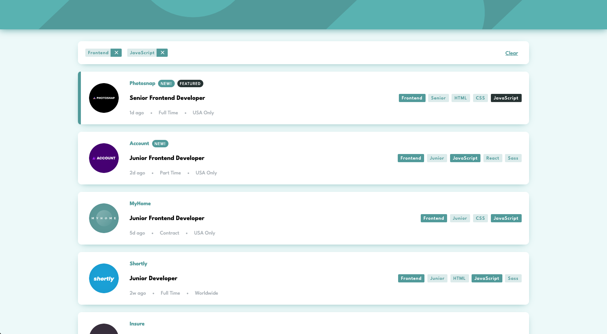

# Frontend Mentor - Job listings with filtering solution

This is a solution to the [Job listings with filtering challenge on Frontend Mentor](https://www.frontendmentor.io/challenges/job-listings-with-filtering-ivstIPCt). Frontend Mentor challenges help you improve your coding skills by building realistic projects.

## Table of contents

- [Overview](#overview)
  - [The challenge](#the-challenge)
  - [Links](#links)
- [My process](#my-process)
  - [Built with](#built-with)
  - [What I learned](#what-i-learned)
- [Author](#author)

## Overview

### The challenge

Users should be able to:

- View the optimal layout for the site depending on their device's screen size
- See hover states for all interactive elements on the page
- Filter job listings based on the categories
- Cache filter in local storage and see the same filters applied when refresh the page or clear filters by removing the value from local storage

### Links

- Live Site URL: [Link](https://frontmentor-job-listing-wfilter-ryc.netlify.app/)

## My process

### Built with

- TypeScript
- SCSS
- Flexbox
- Mobile-first workflow
- [Vue 3](https://vuejs.org/) w/ Composition API
- [Provide/Inject](https://vuejs.org/guide/components/provide-inject.html#provide-inject)
- [Composables](https://vuejs.org/guide/reusability/composables.html#composables)
- [Vue Transitions](https://vuejs.org/guide/built-ins/transition.html#transition)

### What I learned

The main objective of doing this challenge was to create some **composables**, aiming scalability and prevention of some errors, even if in this case could be kind of a "overkill" and unnecessary.

Also, I wanted to get used to `provide` and `inject` since I never really needed to use them, but they are important features from Vue.

## Author

- Frontend Mentor - [@ricardoychino](https://www.frontendmentor.io/profile/ricardoychino)
